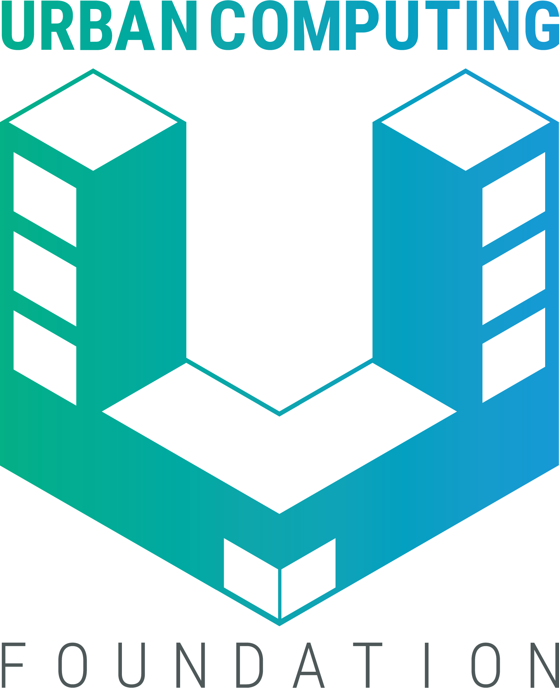
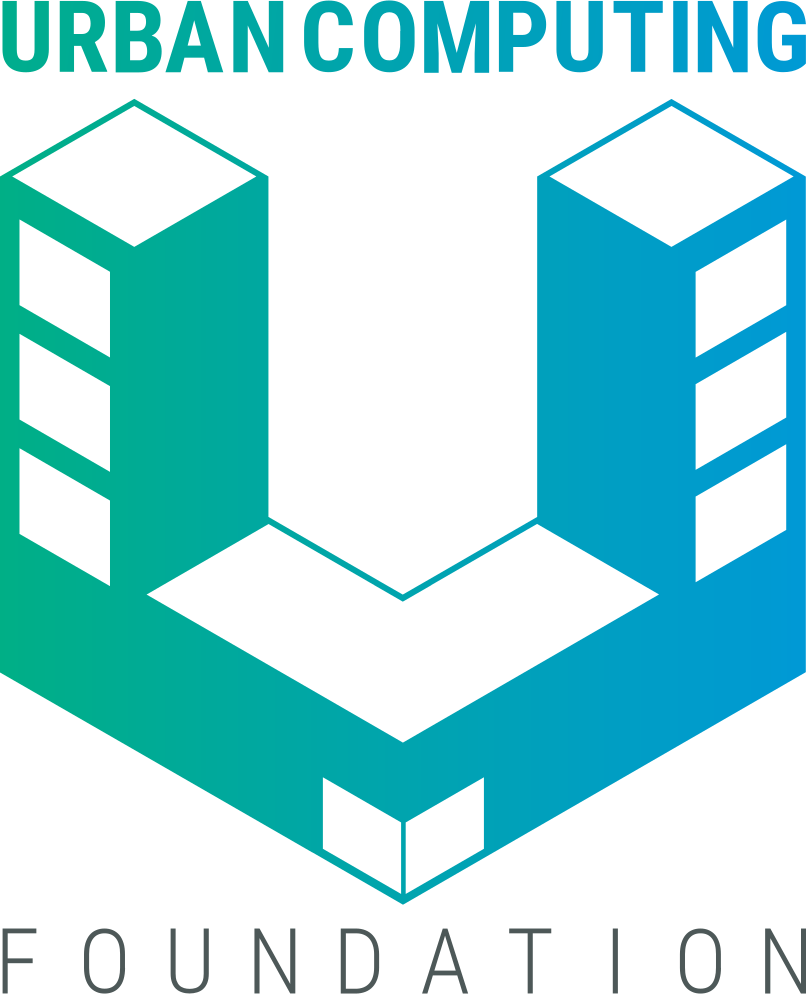
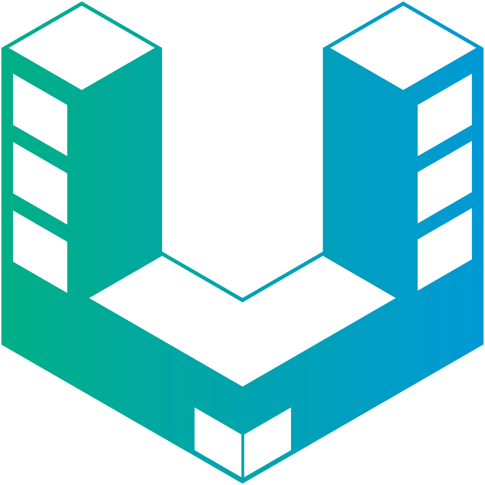
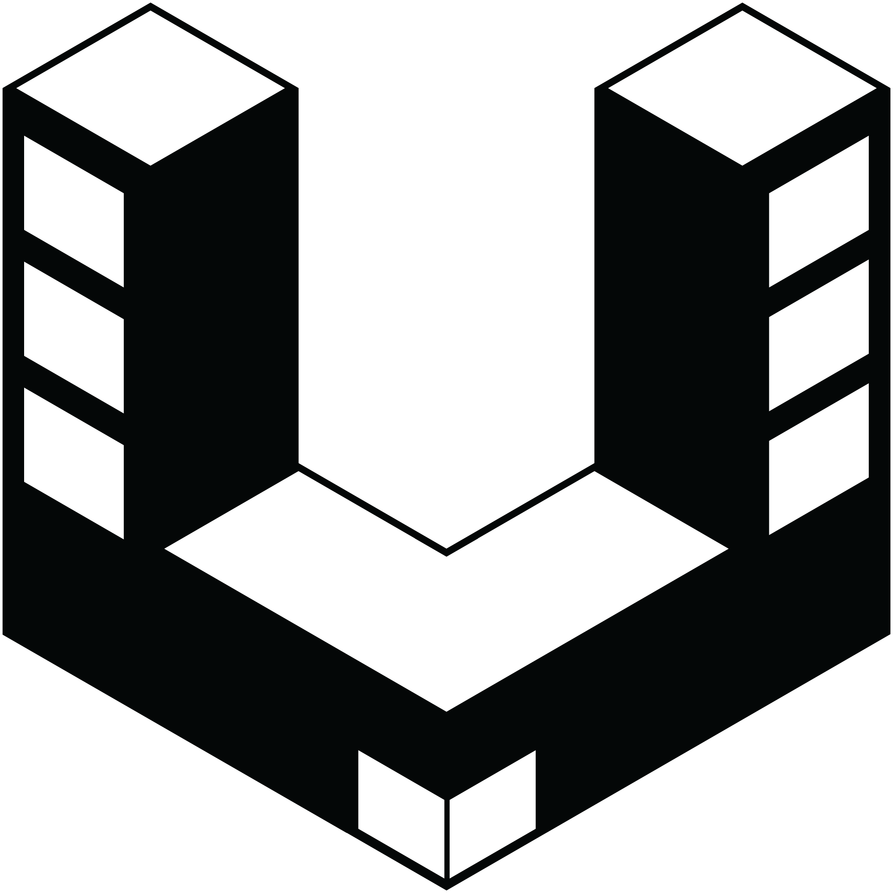

# Urban Computing Foundation Artwork and Logos

*Note: GitHub Flavored Markdown used in the Readme doesn't support background colors. The white logos below are displayed on the light grey of tables.*

## Urban Computing Foundation

* [Brand guidelines](./ucf/Urban_Computing_Foundation-Brand_guidelines.pdf)

### Color Palette

<table style="text-align:center">
	<tr>
		<th colspan=3>
	</tr>
		<th></th>
		<th width="150">RGB</th>
		<th width="150">CMYK</th>
		<th width="150">Pantone</th>
		<th width="150">Hex</th>
	</tr>
		<td></td>
		<td>(0, 175, 154)</td>
		<td>(100, 0, 54, 0)</td>
		<td>3275 C</td>
		<td>#00AF9A</td>
	</tr>
	</tr>
		<td></td>
		<td>(0, 154, 222)</td>
		<td>(77, 25, 0, 0)</td>
		<td>2925 C</td>
		<td>#009ADE</td>
	</tr>
	</tr>
		<td></td>
		<td>(77, 88, 88)</td>
		<td>(69, 54, 54, 0)</td>
		<td>445 C</td>
		<td>#4D5858</td>
	</tr>
</table>

### Logos

<table>
    <tr>
    	<th colspan="7"></th>
    </tr>
    <tr>
        <th></th>
        <th colspan="3">PNG</th>
        <th colspan="3">SVG</th>
    </tr>
    <tr>
        <th></th>
        <th>horizontal</th>
        <th>stacked</th>
        <th>icon</th>
        <th>horizontal</th>
        <th>stacked</th>
        <th>icon</th>
    </tr>
    <tr>
        <th>color</th>
        <td></td>
        <td></td>
        <td></td>
        <td></td>
        <td></td>
        <td></td>
    </tr>
    <tr>
        <th>black</th>
        <td></td>
        <td></td>
        <td></td>
        <td></td>
        <td></td>
        <td></td>
    </tr>
    <tr>
        <th>white</th>
        <td></td>
        <td></td>
        <td></td>
        <td></td>
        <td></td>
        <td></td>
    </tr>
</table>

---

Use of any trademark or logo is subject to the trademark policy available at [https://www.linuxfoundation.org/trademark-usage](https://www.linuxfoundation.org/trademark-usage)

Questions? Please email [info@uc.foundation](mailto:info@uc.foundation).
